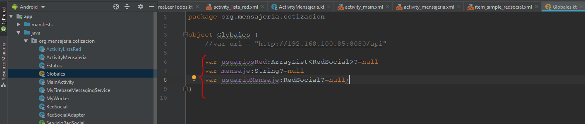

REALIZANDO EL ENVIO DE MENSAJES DE CELULAR A CELULAR

Creamos la clase Globales, la cual contendra las siguientes variables, la variable "usuariosRed" es un arreglo de la clase RedSocial

Creamos el layout activity_lista_red.xml el cual esta asociado a la clase ActivityListaRed

De igual forma creamos el layout item_simple_redsocial.xml el cual servirá para tener todos los datos de los usuarios que ingresen a la apliación, con ésta podremos ingresar foto, nombre del usuario, etc

En este caso añadimos las divisiones de los usuarios, añadimos el ancho de éstas.

En la clase ActivityListaRed lo enlazamos con el layout activity_lista_red.xml el cual será nuestro punto de entrada

El método TareaLeerTodos se va a ejecutar y va a regresar el listado "usuariosred" que es el listado que se han registrado y que tienen su token.
1-.Primero se obtiene los usiarios de la REDSOCIAL a través de la tarea que se conecta al backend.
2-.