# MiAppMensajeria
Repositorio de mensajeria Firebase

El primer paso es generar um muevo proyecto en Android studio en el cual vamos a implementar Firebase.

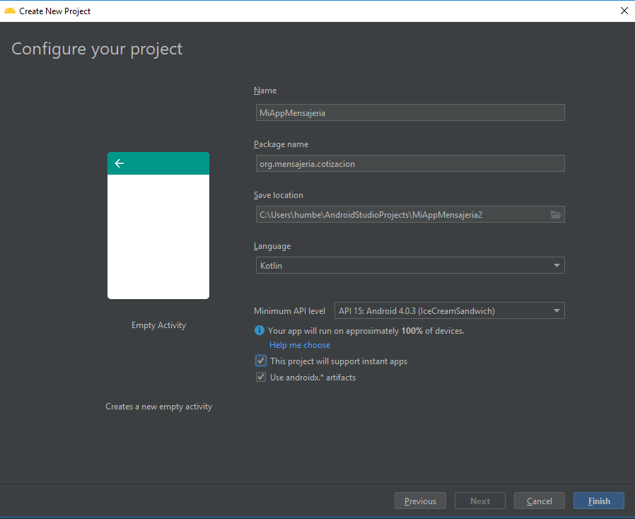

El primer paso es obtener un añadir un proyecto nuevo en firebase, en la siguiente URL y añadir un nuevo proyecto.


Una vez que cingresamos en la opción de genrar un nuevo proyecto, damos el nombre del proyecto a crear

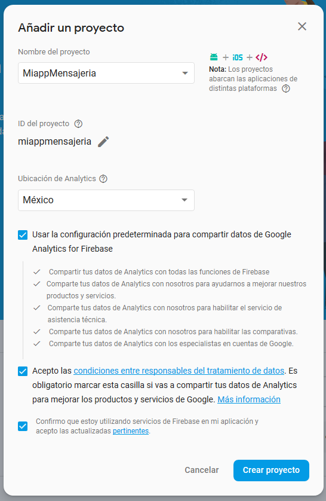

De inmediato se te asigna un id de proyecto, el cual es muy importante, a continuaion se nos pide seleccionar una tecnología, seleccionamos Android

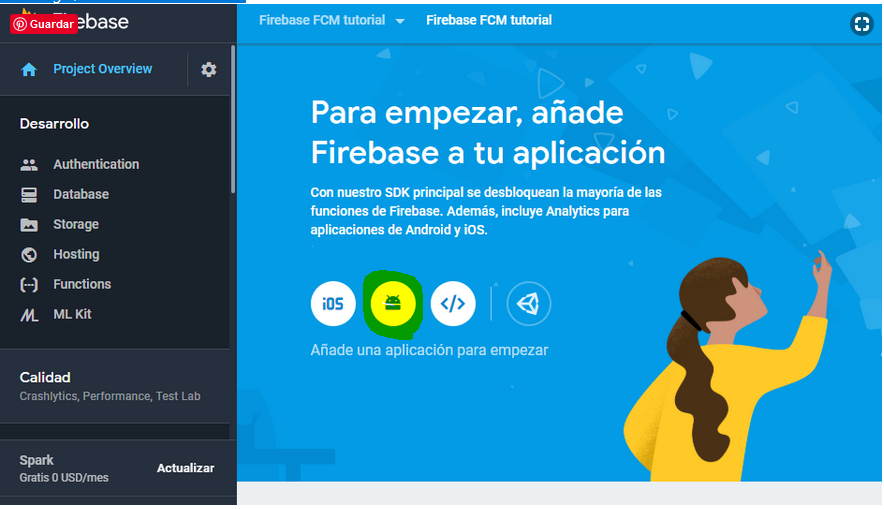

En la siguiente ventana vamos a asignar el nombre del paquete de tu aplicación,el cual es el nombre del id de tu proyecto cuando lo creaste en android studio, lo puedes ver en la el archivo gradle de nivel de modulo o en el nombre del paquete que se generó en la main activity y que todas tus clases tendran. Es muy importante este paquete, ya que firebase va a enlazar tu app directamente a este nombr y si no coincide lo recharzará 

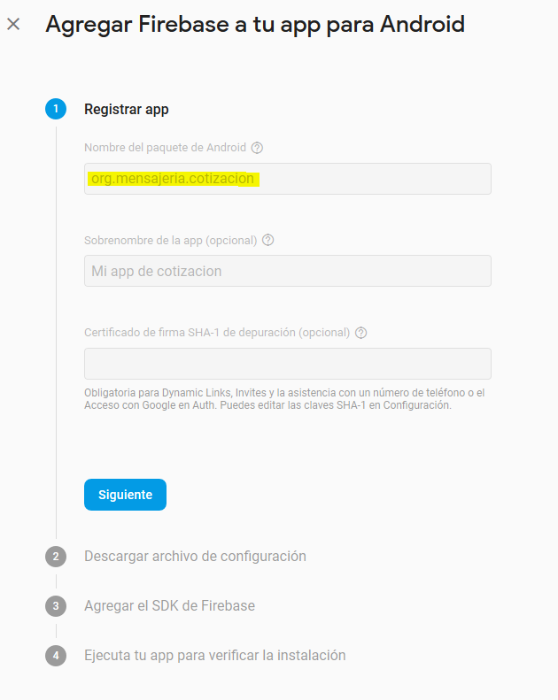

Despues oprimes el boton de Registrar aplicación y el siguente paso es el archivo JSON de descarga de google.services, este archivo lo descargas y te vas a la vista Project de Android Studio y alli pegas ese archivo json dentro de la carpeta app.

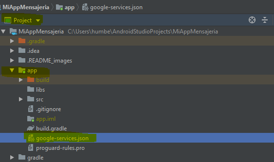

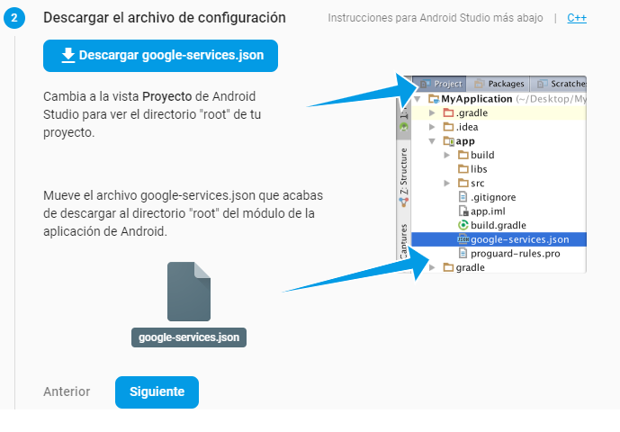

Despues debes de añadir el SDK de firebase a tu proyecto: Primero a nivel de gradle de proyecto vas a agregar

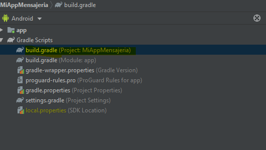

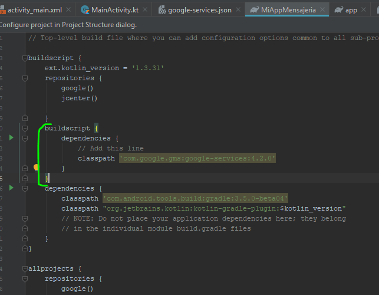

Después en el gradle de nivel de módulo agregar la siguiente dependencia:

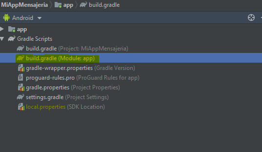

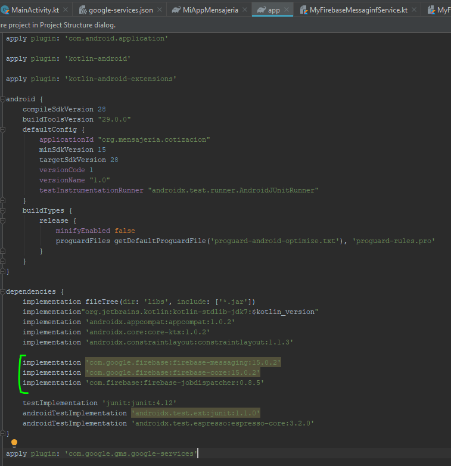

Hasta abajo de ese archivo del build d nivel de modulo se agregará la siguiente linea:

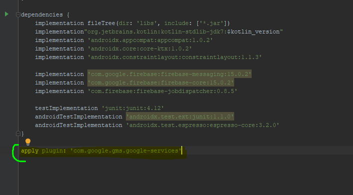


Debemos postetiormente de esto, generar las clases Kotlin:

** MyFirebaseMessaginfService ** MyFirebaseInstanceIDService ** MyJobService 

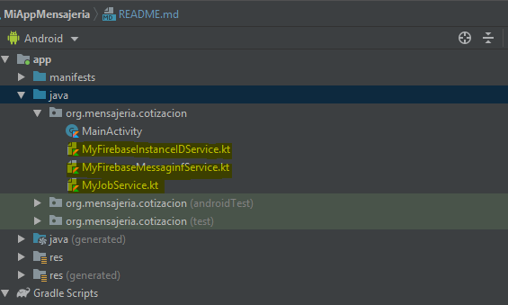


Del repositorio, ingresamos a las rutas para encontrar el código que llevará cada una de las clases que creamos anteriormente, el código que se tienen en éstas es el que indica la página oficial de google:


Ingresamos a la clase MyFirebaseInstanceIDService y copiamos todo el código excepto el package:

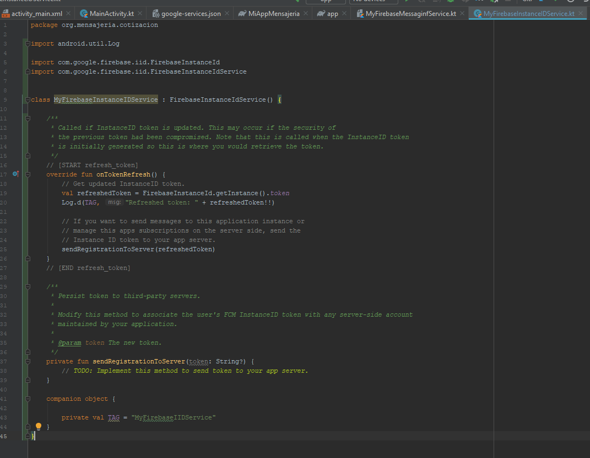

Copiamos el siguiente código de MyFirebaseMessaginfService a nuestro proyecto creado:

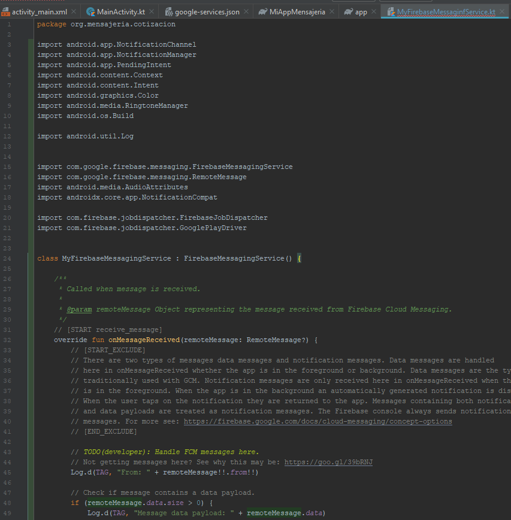

Copiamos el siguiente código de MyJobService a nuestro proyecto creado:

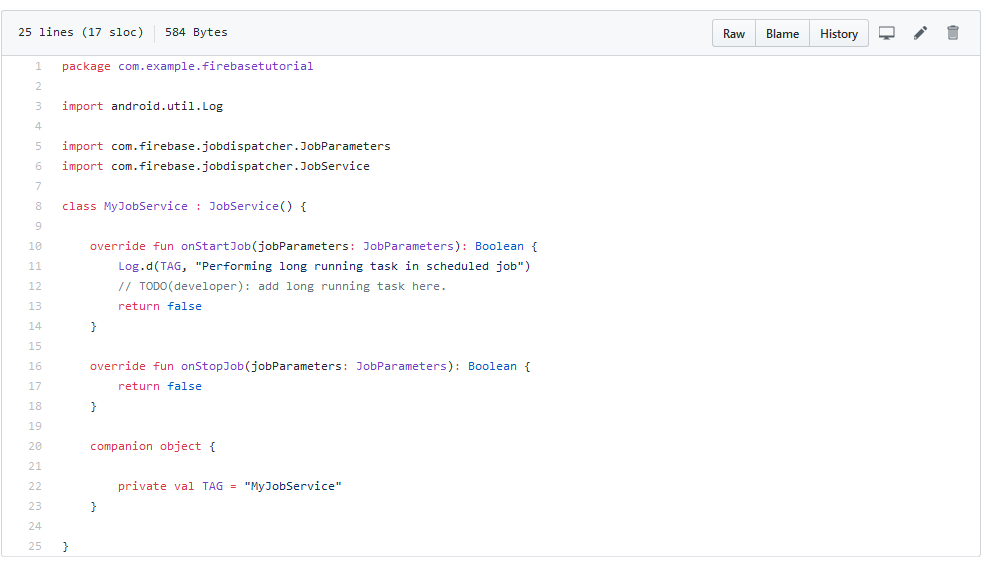

El siguiente paso es agregar los servicios de notificacion siguientes en el archivo AndroidManifest.xml, esto lo debes agregar inmediatamente abajo de la etiqueta de cierre de la activity del manifest
como se inidca a continuación:

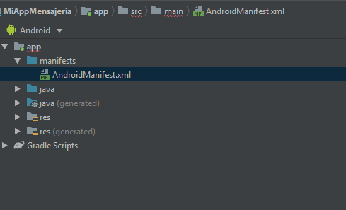

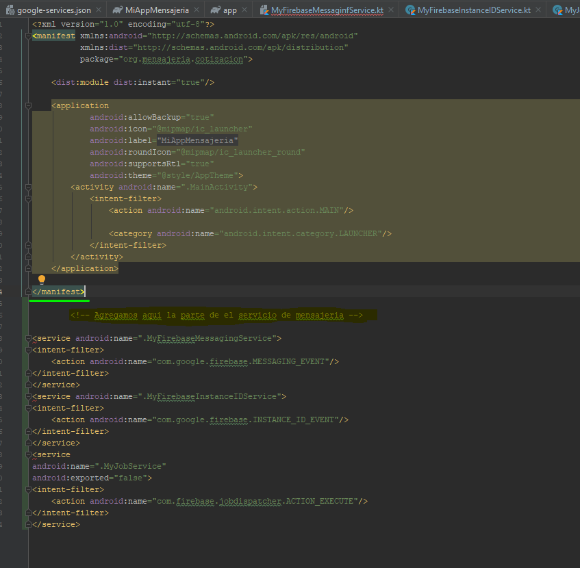

```
<!-- Agregamos aqui la parte de el servicio de mensajeria -->
        <service android:name=".MyFirebaseMessagingService">
            <intent-filter>
                <action android:name="com.google.firebase.MESSAGING_EVENT"/>
            </intent-filter>
        </service>
        <service android:name=".MyFirebaseInstanceIDService">
            <intent-filter>
                <action android:name="com.google.firebase.INSTANCE_ID_EVENT"/>
            </intent-filter>
        </service>
        <service
            android:name=".MyJobService"
            android:exported="false">
            <intent-filter>
                <action android:name="com.firebase.jobdispatcher.ACTION_EXECUTE"/>
            </intent-filter>
        </service>
```


