# MiAppMensajeria
Repositorio de mensajeria Firebase

El primer paso es generar um muevo proyecto en Android studio en el cual vamos a implementar Firebase.


El primer paso es obtener un añadir un proyecto nuevo en firebase, en la siguiente URL y añadir un nuevo proyecto.

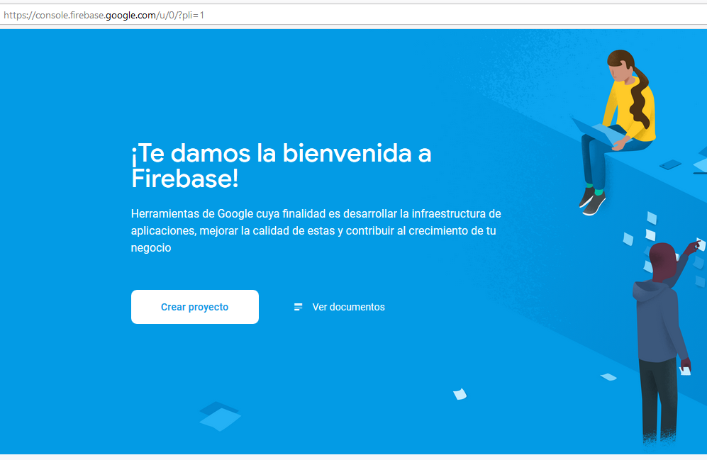

Una vez que cingresamos en la opción de genrar un nuevo proyecto, damos el nombre del proyecto a crear


De inmediato se te asigna un id de proyecto, el cual es muy importante, a continuaion se nos pide seleccionar una tecnología, seleccionamos Android


En la siguiente ventana vamos a asignar el nombre del paquete de tu aplicación,el cual es el nombre del id de tu proyecto cuando lo creaste en android studio, lo puedes ver en la el archivo gradle de nivel de modulo o en el nombre del paquete que se generó en la main activity y que todas tus clases tendran. Es muy importante este paquete, ya que firebase va a enlazar tu app directamente a este nombr y si no coincide lo recharzará 


Despues oprimes el boton de Registrar aplicación y el siguente paso es el archivo JSON de descarga de google.services, este archivo lo descargas y te vas a la vista Project de Android Studio y alli pegas ese archivo json dentro de la carpeta app.


Despues debes de añadir el SDK de firebase a tu proyecto: Primero a nivel de gradle de proyecto vas a agregar


Después en el gradle de nivel de módulo agregar la siguiente dependencia:


Hasta abajo de ese archivo del build d nivel de modulo se agregará la siguiente linea:


Debemos postetiormente de esto, generar las clases Kotlin:

** MyFirebaseMessaginfService ** MyFirebaseInstanceIDService ** MyJobService 


Del repositorio, ingresamos a las rutas para encontrar el código que llevará cada una de las clases que creamos anteriormente, el código que se tienen en éstas es el que indica la página oficial de google:

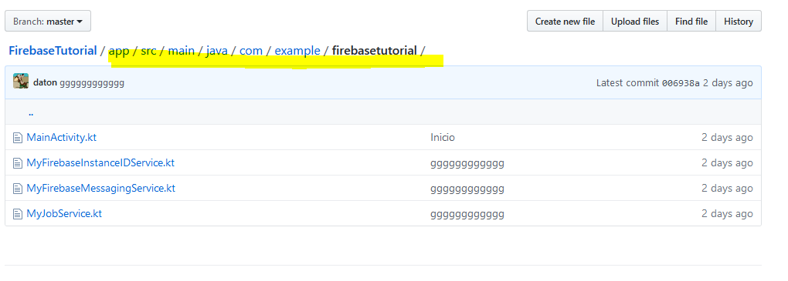

Ingresamos a la clase MyFirebaseInstanceIDService y copiamos todo el código excepto el package:


Copiamos el siguiente código de MyFirebaseMessaginfService a nuestro proyecto creado:


Copiamos el siguiente código de MyJobService a nuestro proyecto creado:


El siguiente paso es agregar los servicios de notificacion siguientes en el archivo AndroidManifest.xml, esto lo debes agregar inmediatamente abajo de la etiqueta de cierre de la activity, antes del cierre del manifest
como se inidca a continuación:


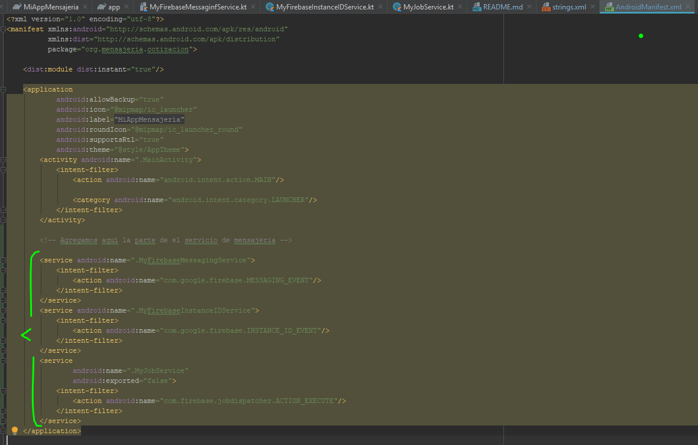

```
<!-- Agregamos aqui la parte de el servicio de mensajeria -->
        <service android:name=".MyFirebaseMessagingService">
            <intent-filter>
                <action android:name="com.google.firebase.MESSAGING_EVENT"/>
            </intent-filter>
        </service>
        <service android:name=".MyFirebaseInstanceIDService">
            <intent-filter>
                <action android:name="com.google.firebase.INSTANCE_ID_EVENT"/>
            </intent-filter>
        </service>
        <service
            android:name=".MyJobService"
            android:exported="false">
            <intent-filter>
                <action android:name="com.firebase.jobdispatcher.ACTION_EXECUTE"/>
            </intent-filter>
        </service>
```

Ingresamos al repositorio a la ruta indicada para poder ingresar al archivo ic_stat_ic_notification.png:

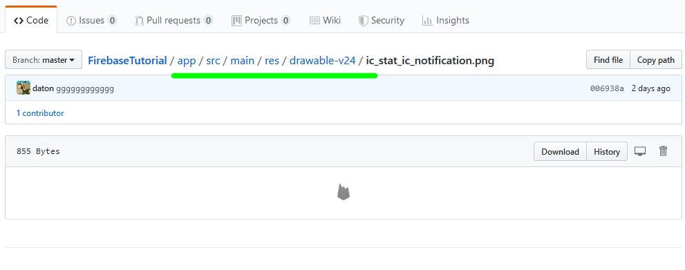

Descargamos el archivo y lo guardamos para copiarlo en la carpeta drawable:

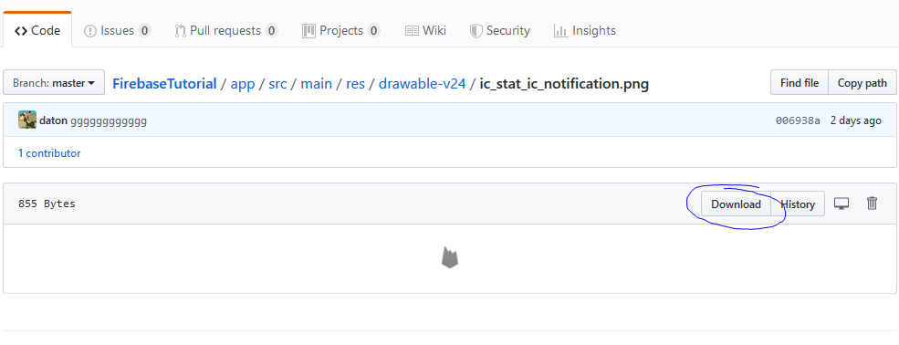

Lo copiamos en la carpeta drawable:

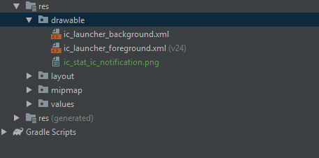

De la ruta indicada en el repositorio, ingresamos a la carpeta "values" e ingresamos al archivo strings.xml:

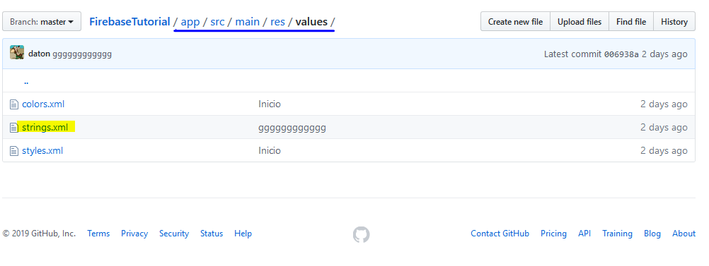

Copiamos el código del archivo strings.xml y lo pegamos en nuestro proyecto dentro de la carpeta "values" en el archivo strings.xml

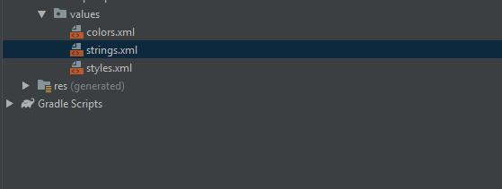

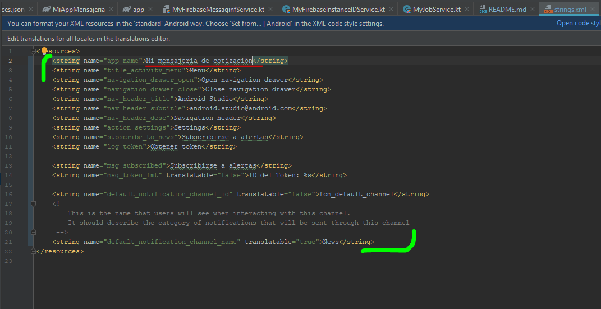

```

<resources>
    <string name="app_name">Salud Unitec</string>
    <string name="title_activity_menu">Menu</string>
    <string name="navigation_drawer_open">Open navigation drawer</string>
    <string name="navigation_drawer_close">Close navigation drawer</string>
    <string name="nav_header_title">Android Studio</string>
    <string name="nav_header_subtitle">android.studio@android.com</string>
    <string name="nav_header_desc">Navigation header</string>
    <string name="action_settings">Settings</string>
    <string name="subscribe_to_news">Subscribirse a alertas</string>
    <string name="log_token">Obtener token</string>

    <string name="msg_subscribed">Subscribirse a alertas</string>
    <string name="msg_token_fmt" translatable="false">ID del Token: %s</string>

    <string name="default_notification_channel_id" translatable="false">fcm_default_channel</string>
    <!--
        This is the name that users will see when interacting with this channel.
        It should describe the category of notifications that will be sent through this channel
     -->
    <string name="default_notification_channel_name" translatable="true">News</string>
</resources>

```

En caso de que nos aparezca del lado izquierdo de la pantalla la instrucción Sync Now le damos ok , para descargar las dependecias correctamente, una voz hecho esto corremos la aplicación.

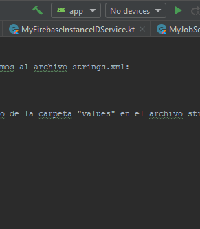


Para continuar con la mensajeria en la app, procedemos a seleccionar nuestro proyecto en Firebase:

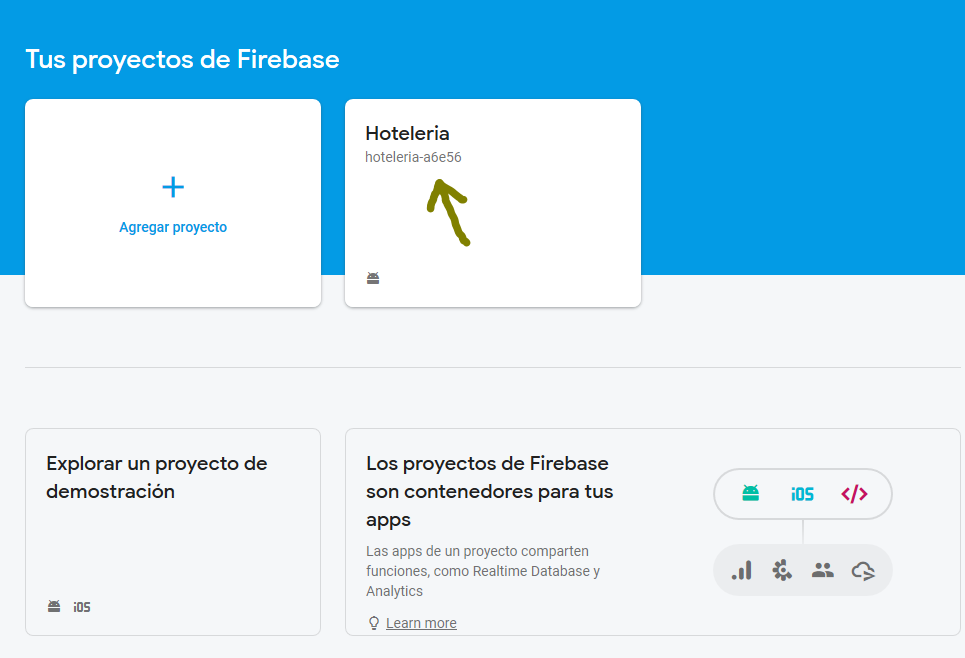

Seleccionamos la Opción "Cloud Messaging":

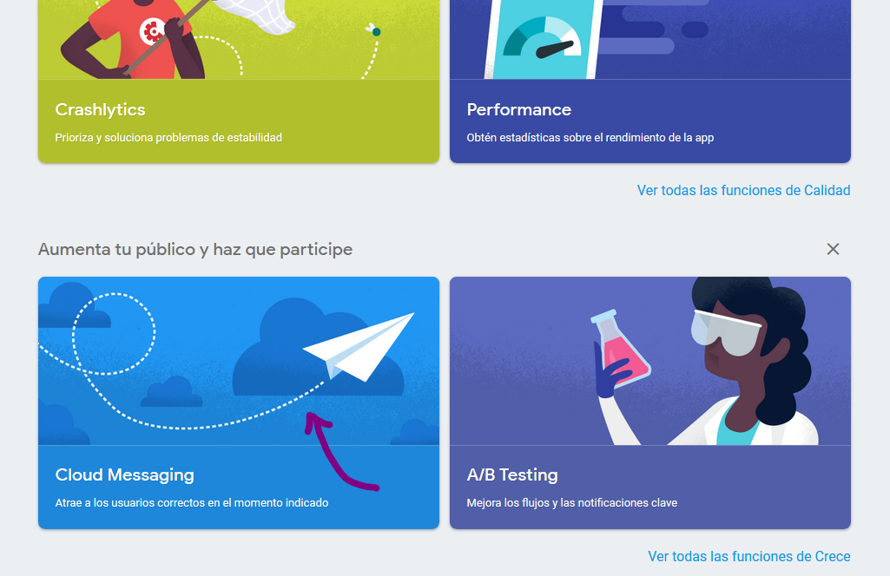

Seleccionamos nuestro primer mensaje:

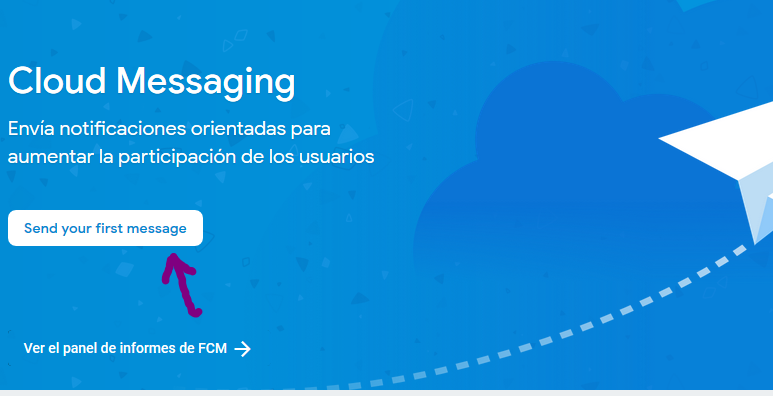

Llenamos los campos correspondientes y damos siguiente:

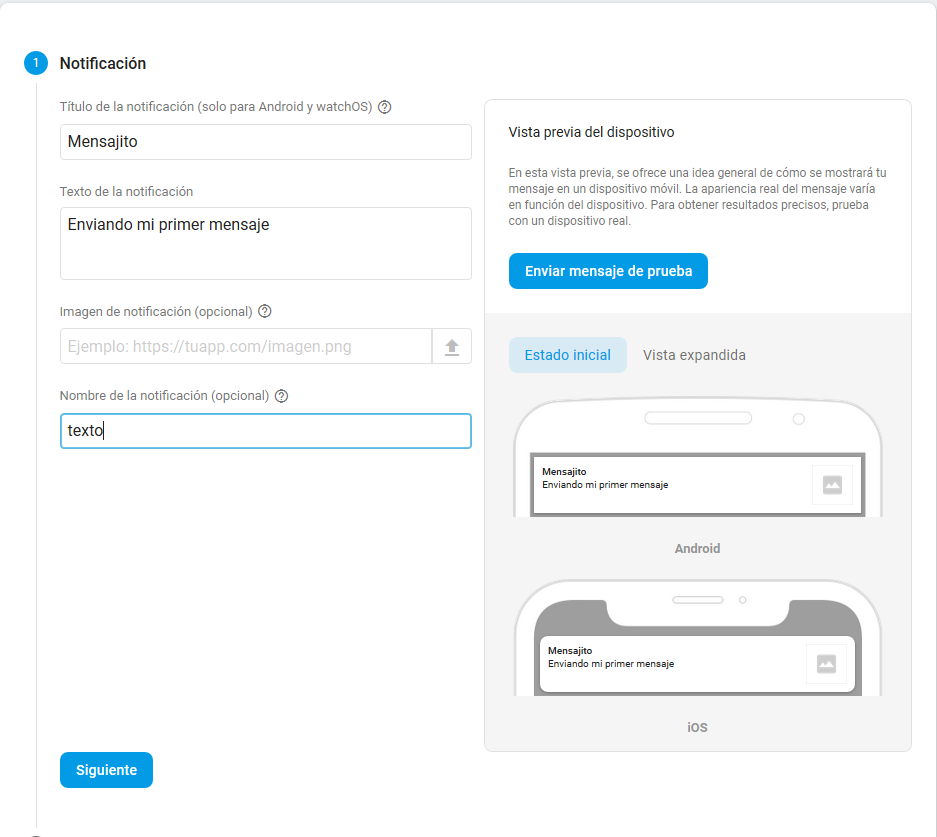

Una vez hecho esto procedemos a seleccionar el nombre de nuestro proyecto:

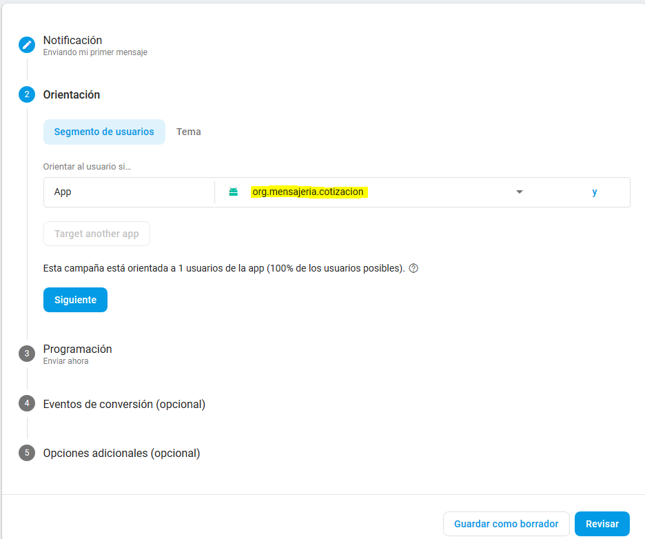

Damos enviar Ahora el mensaje:


Le damos siguiente:

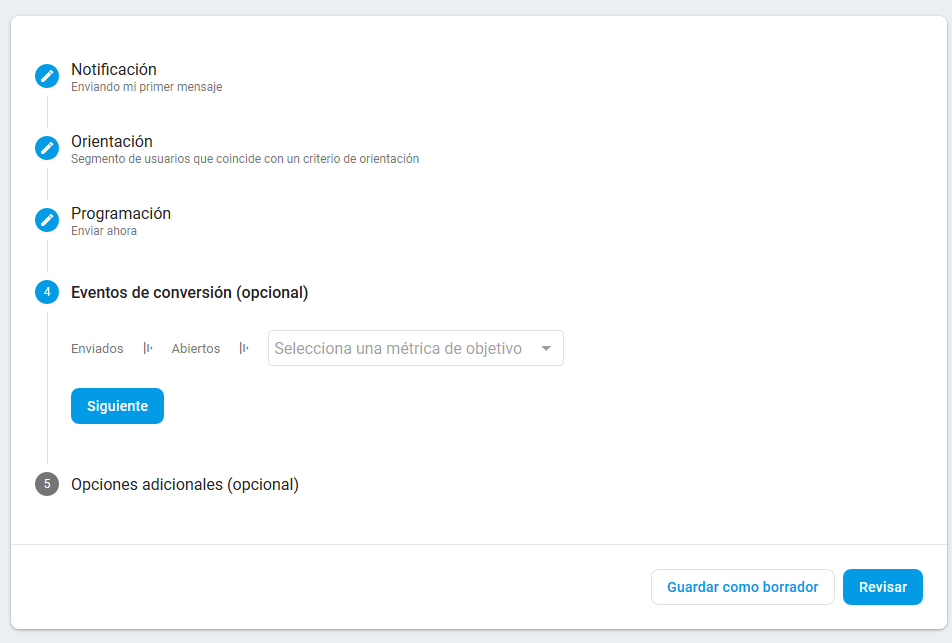

Seleccionamos con sonido Habilitado:

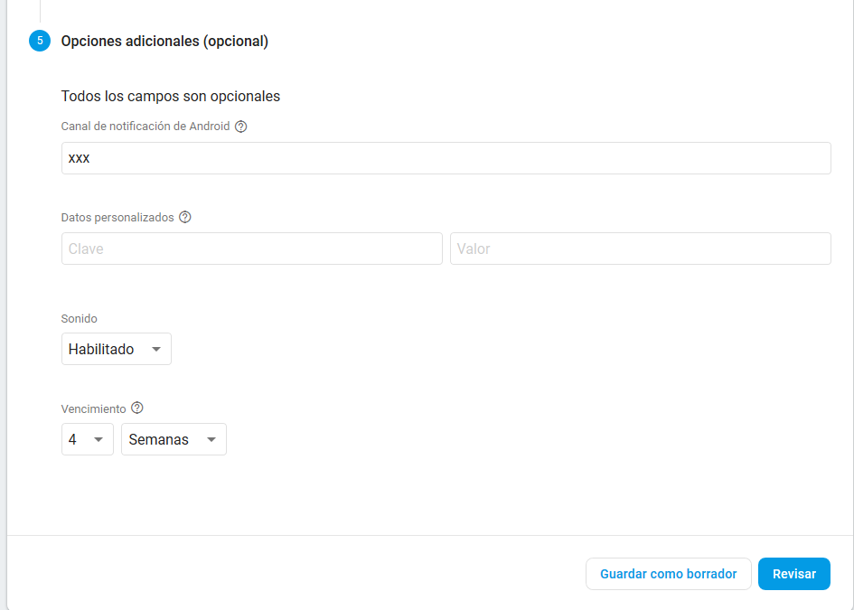

Damos revisar:

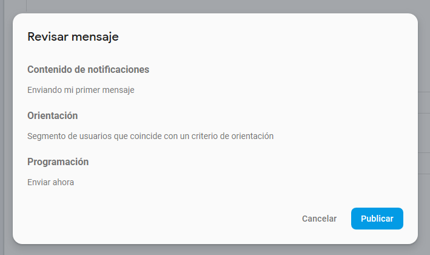

Revisamos desde la consola que se haya enviado el mensaje al celular:

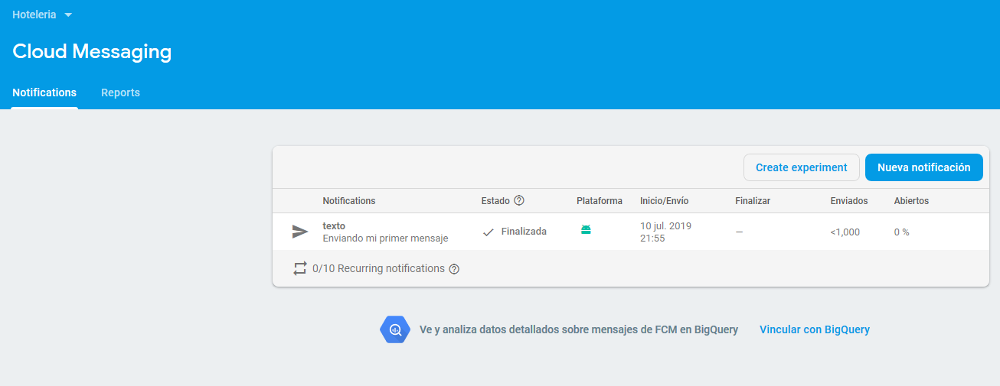

Y esto indica que nos llega una notificación al celular con el mensaje que escribimos desde la consola.


