# MiAppMensajeria
Envió de mensajeria desde la computadora al celular

El primer paso es generar un nuevo proyecto IntelliJ IDEA y posteriormente en Android studio en el cual se implementará FIREBASE con su configuración correspondiente

1-.La configuración de FIREBASE para usarlo en la aplicación que desarrollamos se ha hecho en el tutorial README.

2-.Registramos el TOKEN  que otorga Firebase por cada celular que usará al aplicación, esto lo haremos desde la clase MainActivity.
Generamos con un botón "registrar" en la app, posteriormente lo guardamos en la variable "token" 

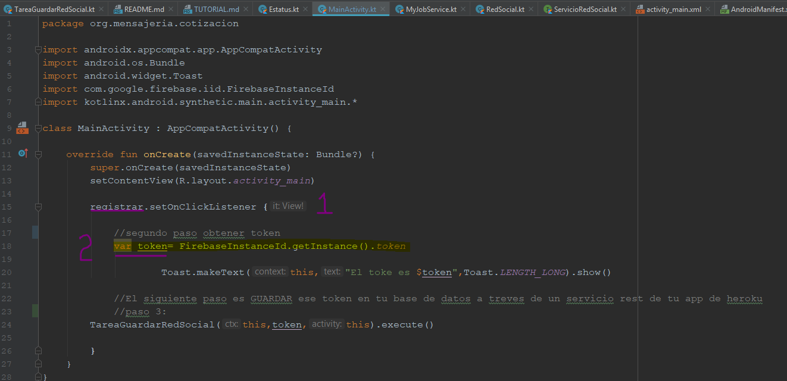

3-.El siguiente paso es GUARDAR ese token en tu base de datos a traves de un servicio REST de tu app de heroku

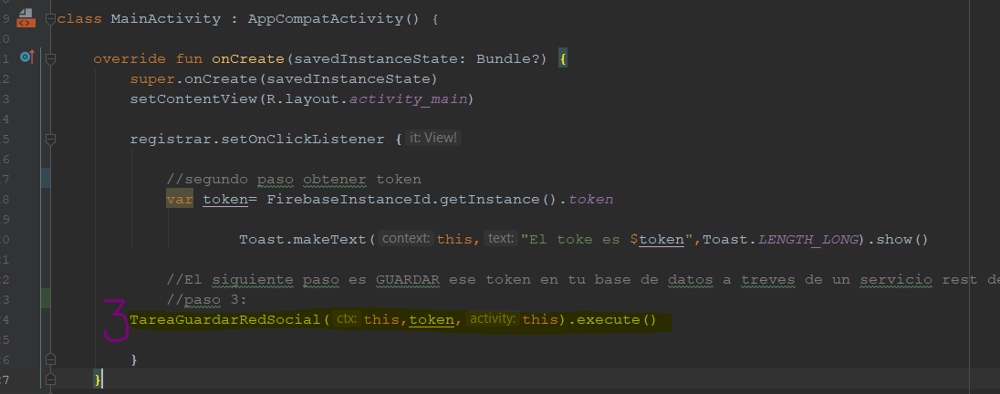

Creamos en Kotlin la case RedSocial ,la cual contendra las variables "token" y "nickname"

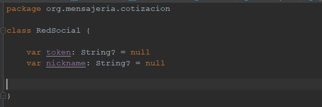

De igual forma creamos en Kotlin la clase Estatus, la cual nos proporcionará un mensaje de respuesta una vez que se haya ejecutado la acción de guardar un objeto:

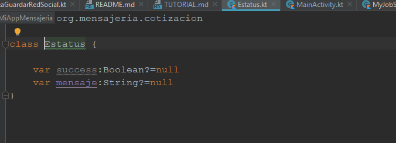

Creamos nuestra clase en kotlin TareaGuardarRedSocial, en donde generaremos un objeto para cada una de estas clases, un objeto "estatus" de la clase Estatus y otro objeto "redsocial" de la clase RedSocial

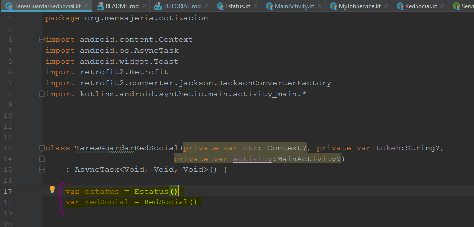

Dentro de esta clase se hara la captura de los datos desde nuestro celular, los cuales se harán en el override fun onPreExecute(), previo se hace el enlace del layout de la interfaz del celular:

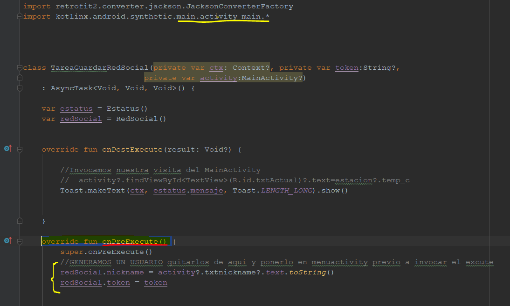

El siguiente proceso es usar el Retrofit para poder enviar la información capturada en el celular al back end (nuestro servidor heroku)
1-.Creamos nuestro objeto retrofit
2-.Le indicamos la ruta donde guardara la información capturada.
3-.Hacemos la indicación que la información capturada sea convertida en un objeto Json ya que es necesario realizar este paso para que en el back end ésta información
pueda ser recibida y guardada.

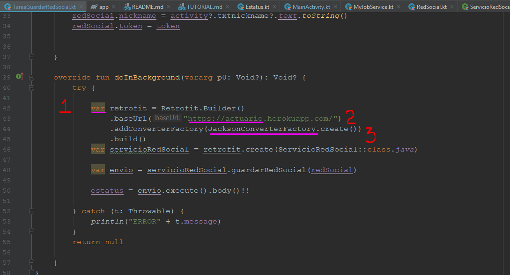

Creamos nuestro ServicioRedSocial, la cual contiene los funciones CRUD, que con la ayuda de Retrofit nos ayudará a guardar la información recibida.
En este caso solo utilizaremos el PUT y GET.

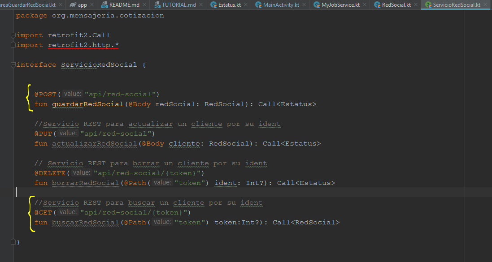

1-.Una vez que tenemos nuestro servicio RedSocial crearemos una variable de ésta clase con la finalidad de guardar nuestro objeto redSocial (con token y nockname)
2-.Generamos nuestra variable "envio" el cual enviará nuestro objeto "redsocial", utilizando un objeto de la clase Estatus para notificarnos que se ha ejecutado la acción solicitada.

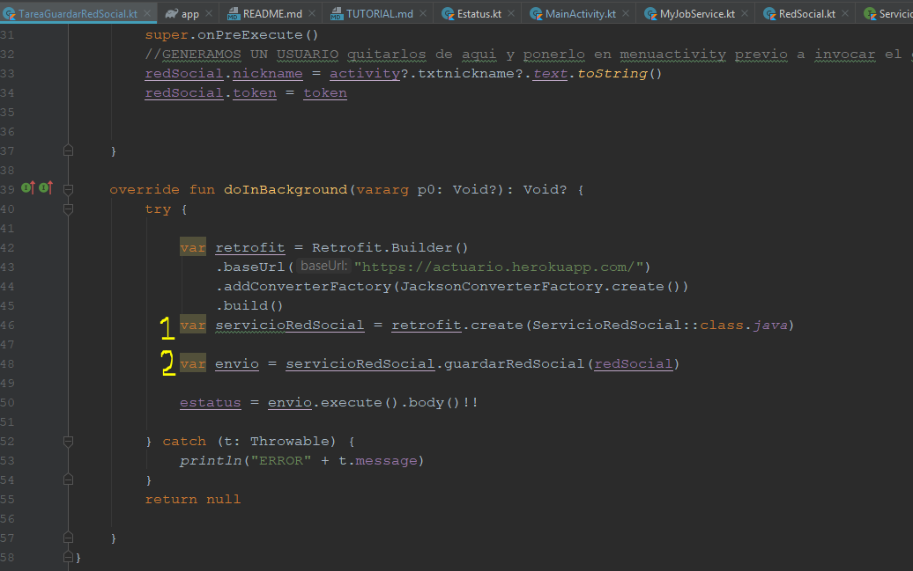

Ahora en el IntelliJ IDEA, necesitamos crear nuestras clases homólogas a las que se crearon en Kotlin.
Creamos la clase RedSocial con el mismo número de variables pues deben de coincidir ya que en caso de no ser las mismas variables nos marcará error.
Cada una de nuestras variables dentro de ésta clase tienen los métodos get y set correspondientes.

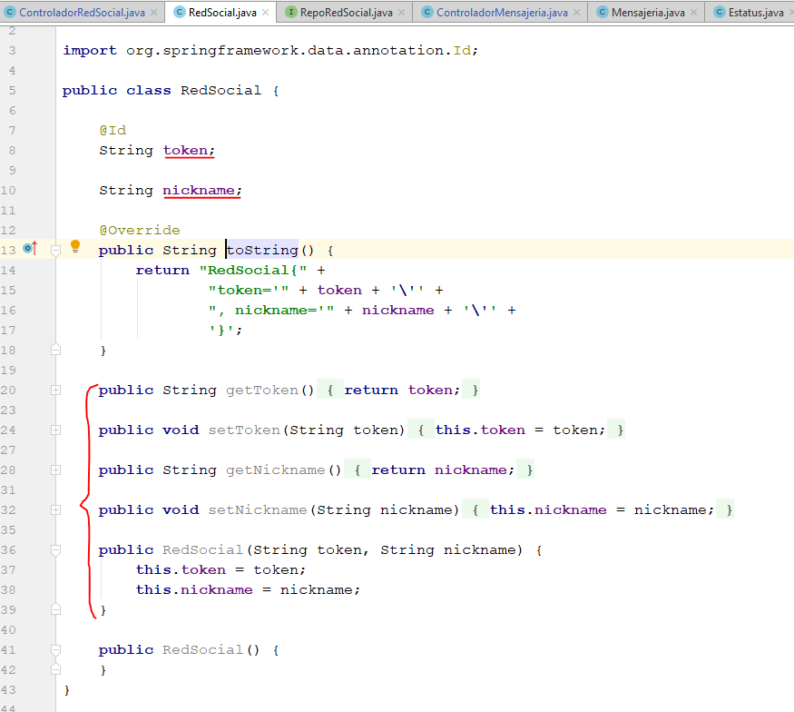

Creamos nuestra Clase RepoRedSocial, ésta clase es la que hará la función de guardar nuestra información en la base de datos MongoDB, es decir, nos genera un repositorio 
para la infomación que se va a guardar.

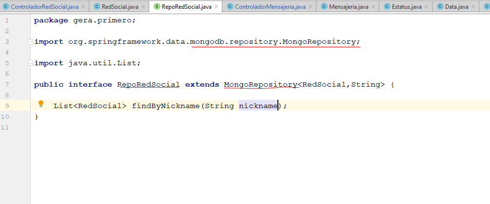

Esta es la parte importante del proceso, una vez que se tiene el objeto redsocial debemos GUARDARLO en nuestro servidor.
Para esto generamos nuestro controlador ControladorRedSocial, el cual recibirá el objeto redsocial, se hará el mapeo correspondiente.
1-.Con el método POSTMAPPING se guardará la información que se esta capturando 

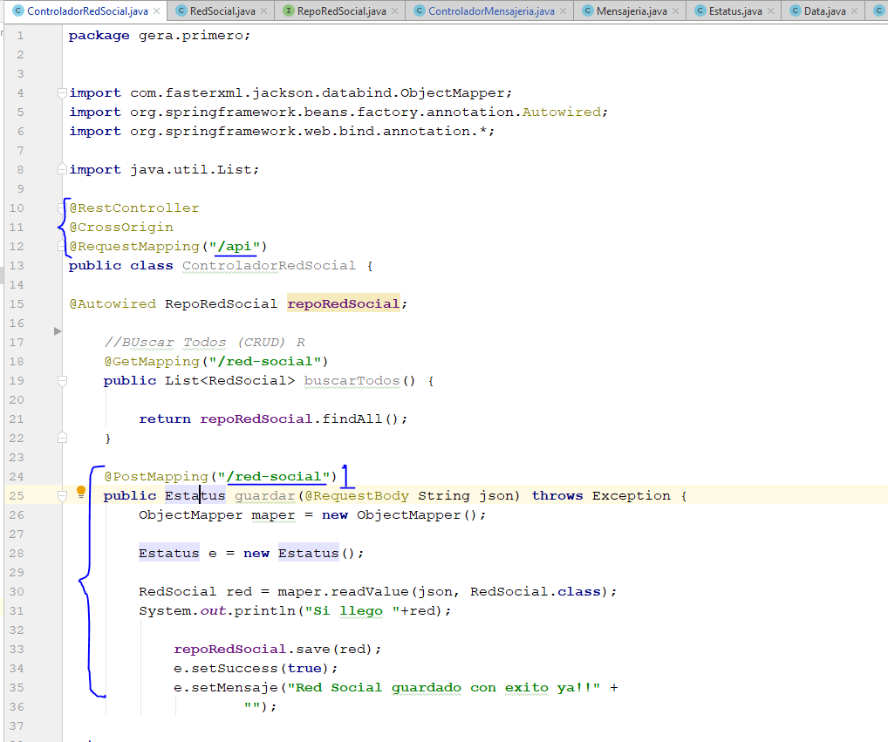

2-.Creamos un objeto "maper" de la clase ObjectMaper 
3-.Creamos un objeto "red" de la clase RedSocial con el cual se hará el mapeo para poder guardar la información de éste objeto.
En el mapeo se hará para tomar un objeto JSON y convertirlo a un objeto JAVA, esto con la finalidad que pueda ser interpretado por la clase correspondiente.

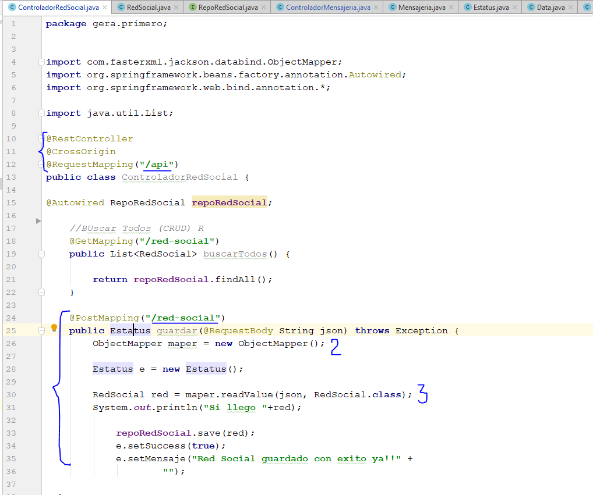
    
4-.Guardamos nuestro objeto "red" en el repositorio repoRedSocial

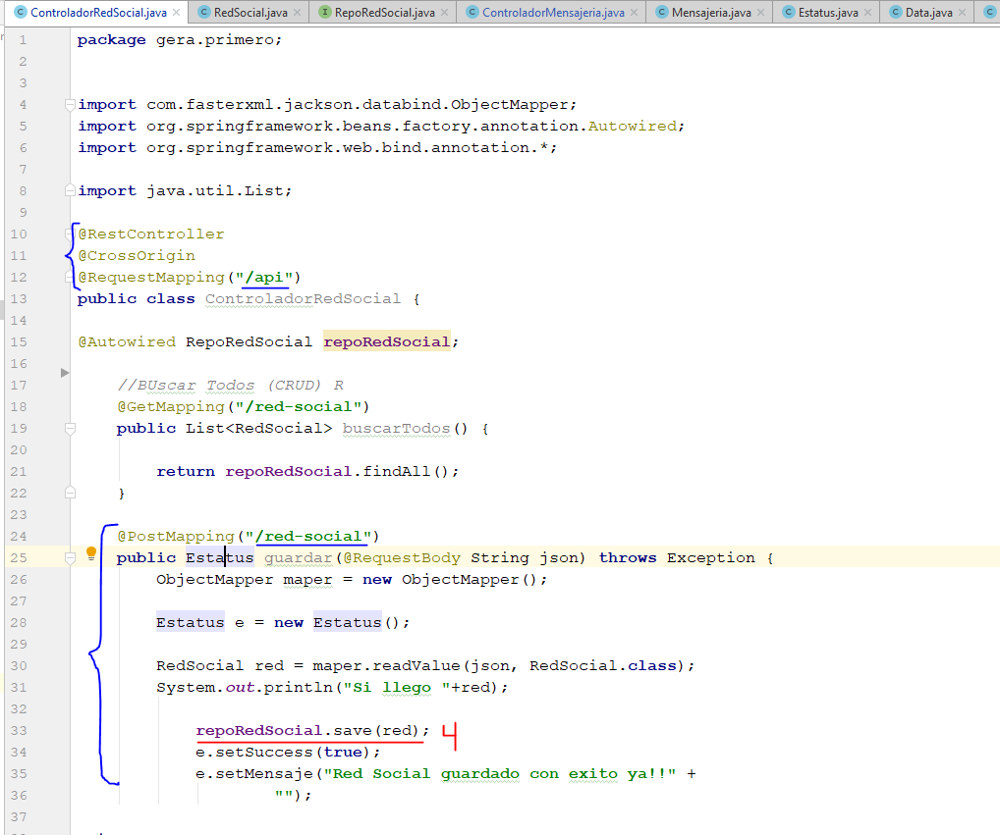

Es importante mencionar que las apis construidas deben de nombrarse igual a las que se tienen en Kotlin en la clase ServicioRedSocial.

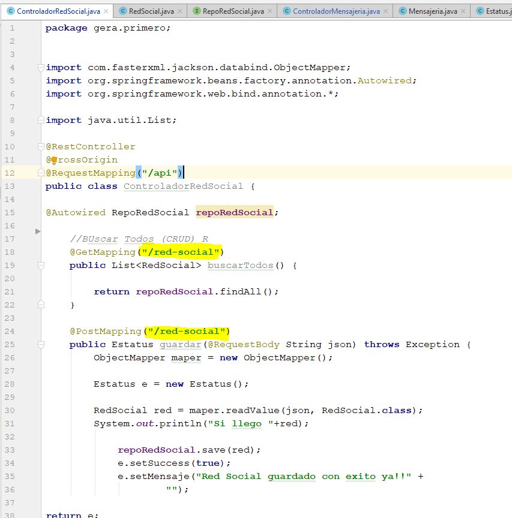
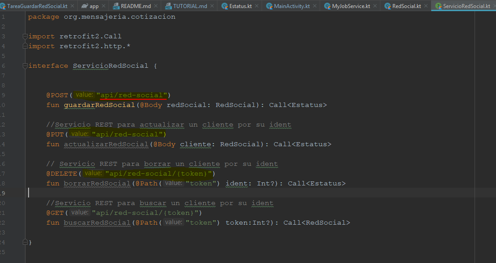

Ahora nos enfocaremos a la clase MyFirebaseMessagingService.kt dado que el método "sendNotification(messageBody: String)" es el que se encargará
de enviar el mensaje de NOTIFICACIÓN a nuestro celular.

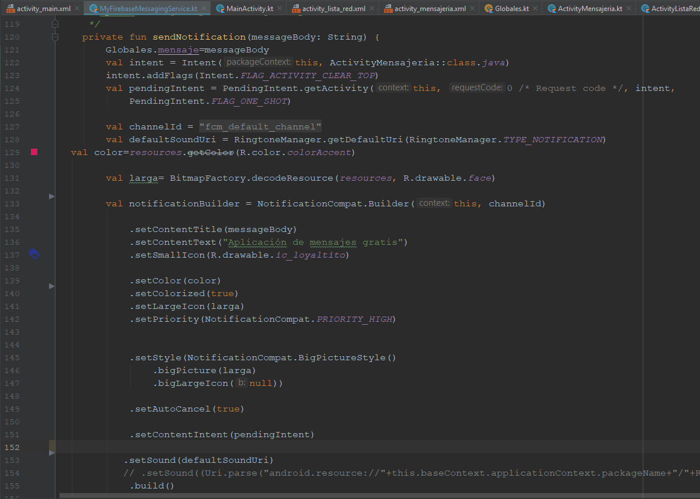

En esta parte del código indicamos el color que tendrá el texto de la notificación

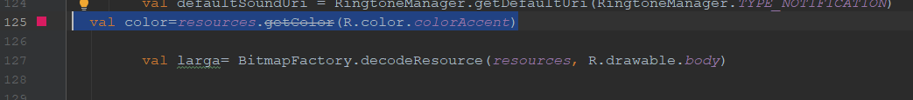

La siguiente parte nos indicará el tamaño de la notificación, así como la imagen que mostrará la notificación, es decir, nos mostrará en tamaño grande o pequeño de la imagen y de la notificación.

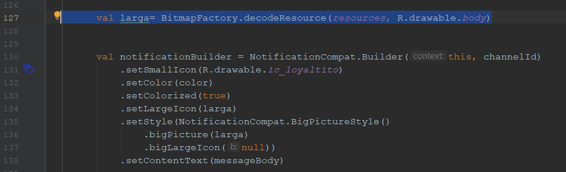

En la siguiente parte señalada se indica la imagen que mostrará la notificación, ésta debera ser previamente cargada en la parte de drawable.

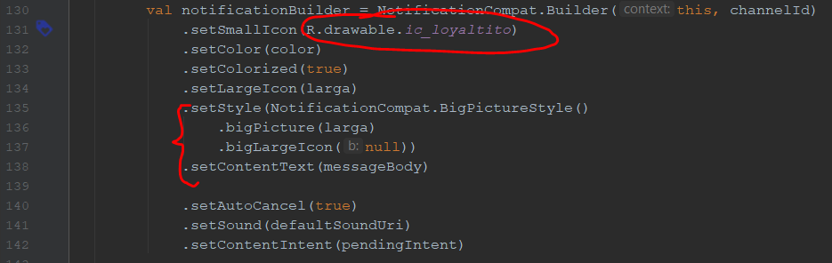

La siguiente parte del código, es para indicar la importancia de la notificación, ya que puede ser Baja, Alta, o Default.

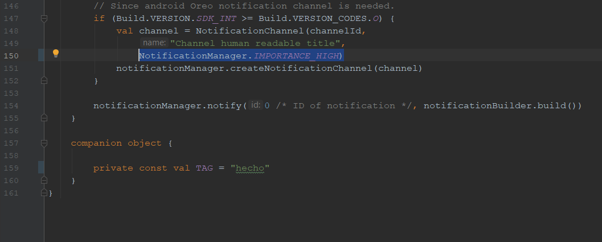

